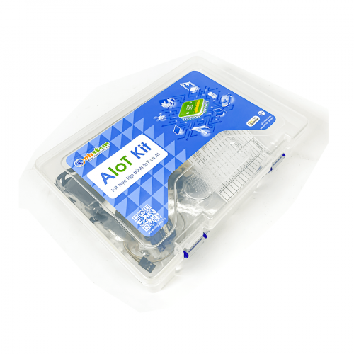
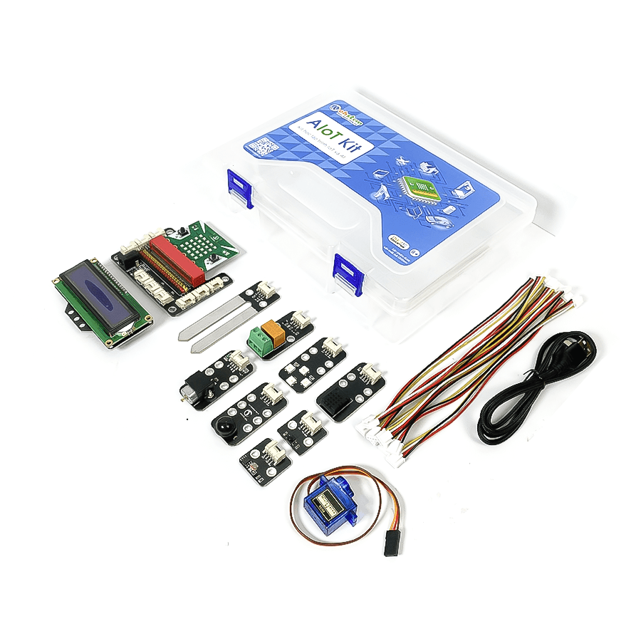
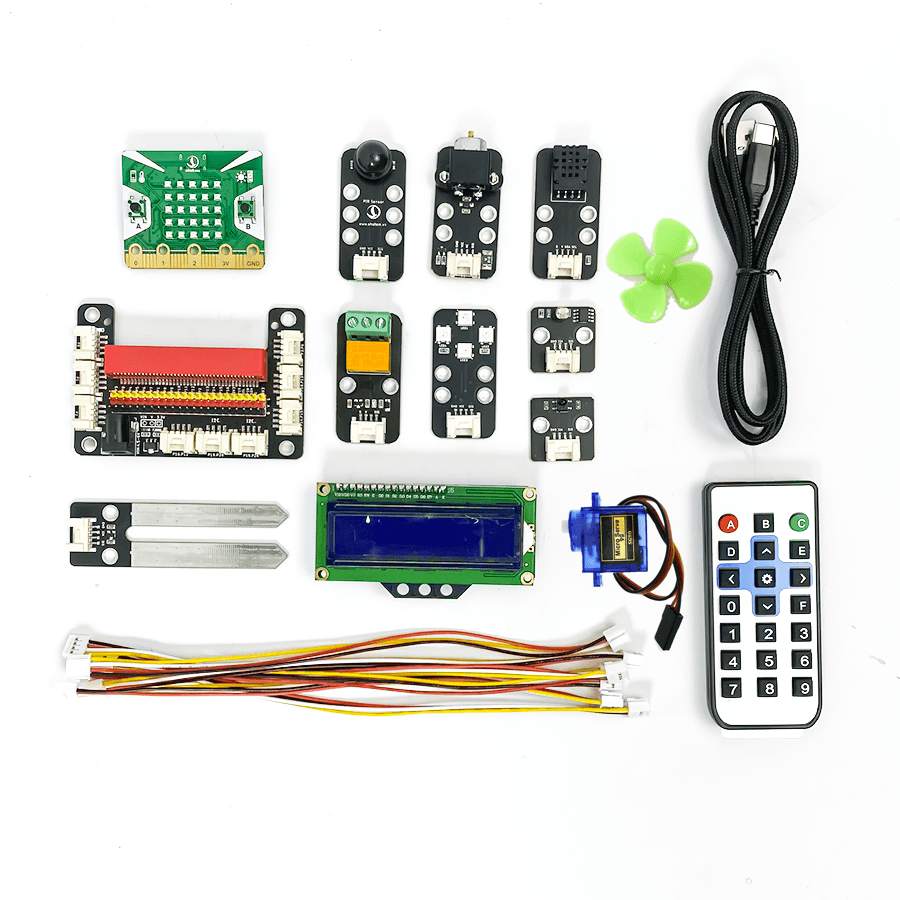
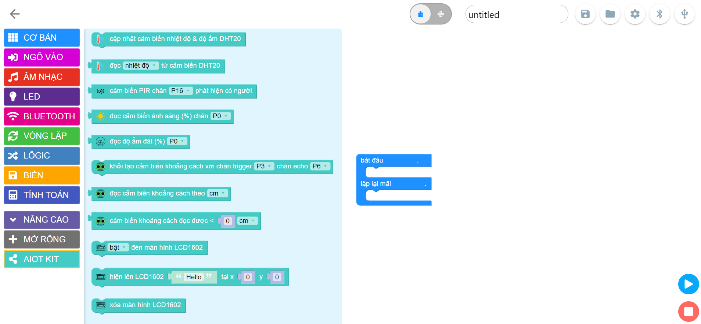

# yolobit_extension_aiot

  
  <h1>OhStem Education</h1>
  
  

    AIoT kit là bộ sản phẩm giúp học lập trình IoT (Internet of Things) và trí tuệ nhân tạo AI một cách dễ dàng.
  

  
<!-- Badges -->
  
<h4>
    <a href="https://ohstem.vn/product/aiot-kit-hoc-lap-trinh-iot-va-ai/">Cửa hàng</a>
     · 
    <a href="https://drive.google.com/file/d/1XpBR5jYpCiuZ7BHxXXskfqOK_cRgNH_m/view">Sách hướng dẫn sử dụng</a>
   · 
    <a href="https://docs.ohstem.vn/en/latest/yolobit_v2/aiot.html">Tài liệu tham khảo</a>

<!-- Danh sách các thiết bị trong bộ AIoT Kits-->

# :notebook_with_decorative_cover: Danh mục thiết bị trong bộ AIoT Kits

- [Yolo:Bit](https://ohstem.vn/product/may-tinh-lap-trinh-yolobit/)
- [Cáp USB type C](https://ohstem.vn/product/day-cap-ket-noi-micro-usb-1m/)
- [Mạch mở rộng](https://ohstem.vn/product/grove-shield/)
- [Cảm biến nhiệt độ độ ẩm DHT20](https://ohstem.vn/product/cam-bien-dht20/)
- [Remote](https://ohstem.vn/product/remote-dieu-khien/)
- [Màn hình LCD](https://ohstem.vn/product/man-hinh-lcd-1602/)
- [4 LED RGB](https://ohstem.vn/product/module-4-led-rgb/)
- [Mắt đọc IR](https://ohstem.vn/product/mat-doc-hong-ngoai-ir/)
- [Quạt mini](https://ohstem.vn/product/dong-co-quat-mini/)
- [Cảm biến ánh sáng](https://ohstem.vn/product/cam-bien-anh-sang/)
- [Cảm biến độ ẩm đất](https://ohstem.vn/product/cam-bien-do-am-dat/)
- [Relay](https://ohstem.vn/product/relay/)
- [Cảm biến chuyển động PIR](https://ohstem.vn/product/cam-bien-pir/)
- [Động cơ Servo SG90 180 độ](https://ohstem.vn/product/dong-co-servo-mg90s/)
- [Cảm biến khoảng cách](https://ohstem.vn/product/cam-bien-sieu-am/)
- [USB đóng ngắt 2 kênh](https://ohstem.vn/product/module-dong-ngat-2-kenh/)
- [Máy bơm mini USB](https://ohstem.vn/product/may-bom-mini/)
- [Dây tín hiệu](https://ohstem.vn/product/day-noi-tin-hieu/)

<!-- Screenshots -->

### :camera: Hình ảnh về bộ kit

 
  

 
  

 
  

 
  

<!-- Contact -->

## :handshake: Thông tin liên hệ

Trang WEB chính thức: [https://ohstem.vn/](/https://ohstem.vn/)

Số điện thoại: [08.6666.8168](08.6666.8168)

Email: [contact@ohstem.vn](contact@ohstem.vn)
